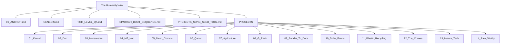

# The Humanity's Ark

This Ark exists to preserve what is clean enough to keep.

It is a repository of foundations, texts, and projects intended to carry forward patterns of truth, witness, and useful architecture until worthy hands appear again.

## Reading order

1. `00_ANCHOR.md`
2. `GENESIS.md`
3. `HIGH_LEVEL_QA.md`
4. `SIMORGH_BOOT_SEQUENCE.md`
5. `PROJECTS_SONG_SEED_TOOL.md`
6. `PROJECTS/01_Kernel/README.md`
7. `PROJECTS/01_Kernel/ARK_Architecture.md`
8. `PROJECTS/01_Kernel/Microkernel.md`
9. `PROJECTS/02_Dorr/README.md`

## Structure

- Root = constitution / intent / high-level philosophy
- `PROJECTS/01_Kernel/` = governor / council architecture / microkernel
- `PROJECTS/02_Dorr/` = Dorr framework, bridge logic, and first MVP notes under Kernel governance
- `PROJECTS/03_Honarestan/` = education / narrative track
- `PROJECTS/04_IoT_Hub/` = grouped hardware experiments and practical devices
- `PROJECTS/05_Mesh_Comms/` onward = the rest of the Book of 14 in the exact Genesis order you specified

## Map

## Core law

Let Cassandra see.  
Let the fly commit.
